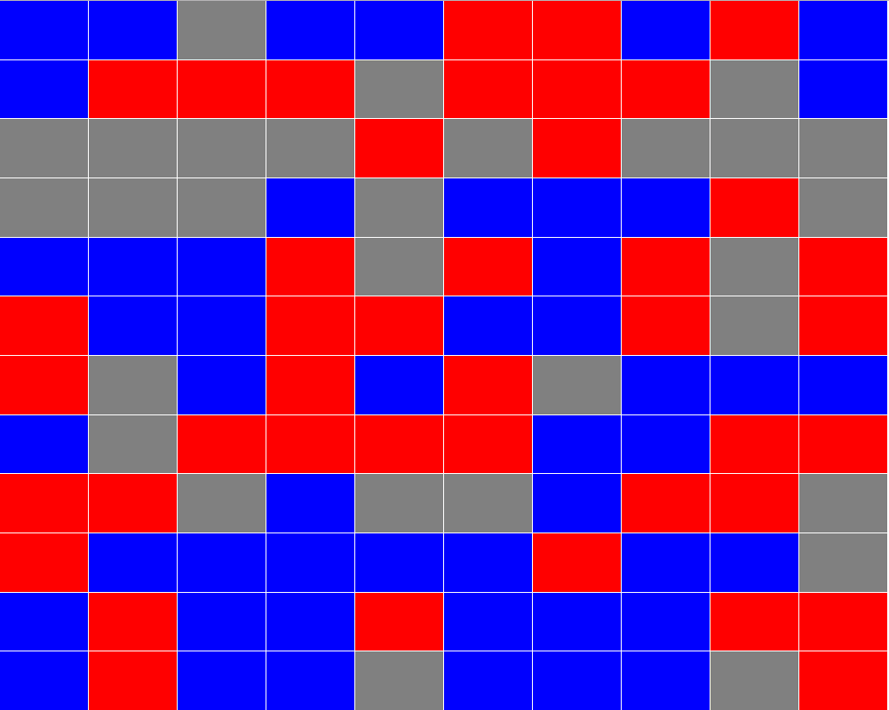

# Continuous Color Grid Count Challenge
In this challenge, contestants need to write a program to analyse a given color grid, and find out the largest continuous color block in the given grid. Here is an example of the color grid problem.

As shown in the picture above, a color grid is a two-dimensional board formed by color nodes. Here are some Facts about the color grid:
<ul>
  <li>Each color grid consists of <b>Rows</b> and <b>Columns</b>, where the rows and columns can be uneven</li>
  <li>Each <b>Node</b> in the color grid has its color code (e.g. Blue, Red, Green, etc), and also coordinates</li>
  <li>Each node can have a number of <b>Neighbour/Adjacent Nodes</b>. Depend on its location/coordinate, a node can have up to 4 neighbour nodes, or two neighbour nodes if it’s in the corner.</li>
  <li>The color grid can have <b>N</b> number of colors, and <b>X</b> number of rows, as well as <b>Y</b> number of columns. <b>N, X, Y</b> are unknown in the problem, and is not given at the beginning of the test.</li>
</ul>

**The Challenge:** since each color node can be adjacent to a number of other color nodes, you need to find out the largest connecting block of nodes with the same color. (In the above image, by looking at the image we know that the largest block of joining nodes is at the bottom part of the image with blue color)

**Solution:**
<ul>
  <li>You can choose the programming language of your choice</li>
  <li>You can use any types of data model to store the grid information</li>
  <li>You can use any algorithm in your program to conduct the search</li>
  <li>The solution will be evaluated based on its accuracy and speed</li>
</ul>

**Tips:**
<ul>
  <li>Start with designing the right data model to store the color grid and search result</li>
  <li>Try avoid using recursion for large color grid, however, recursion can be used in some cases with careful design</li>
</ul>
